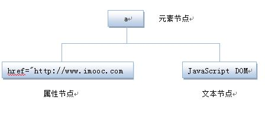

# JavaScript

# 一、JS入门

## 1.基础知识

### 1.Helloworld

```javascript
<script>
    document.write("hello world!")
	document.getElementById("p1").style.color = "blue"
</script>
```


### 2.JS代码位置

#### 2.1 代码放在HTML文档中

- 使用<script>标签,并在HTML网页中插入JavaScript代码。
  - `<script type="text/javascript">`表示在<script></script>之间的是文本类型(text)
  - javascript是为了告诉浏览器里面的文本是属于JavaScript语言。


#### 2.2 代码放在JS文件中

- 创建一个JavaScript文件(简称JS文件),其文件后缀通常为.js
- **在JS文件中，不需要<script>标签,直接编写JavaScript代码。**

HTML中引用方式：

```html
<script src="文件名.js"></script>
```

#### 2.3 JS语言在页面中的位置

> 2.1与2.2主要是**JS代码**的存在形式（JS能长成什么样子）
>
> 2.3是指JS语言在HTML页面的位置（JS放在哪里）

- javascript作为一种脚本语言可以放在html页面中任何位置
- 浏览器解释html时是按先后顺序的，所以前面的script就先被执行。
  - 进行页面显示初始化的js必须放在head里面，因为初始化都要求提前进行（如给页面body设置css等）
  - 而如果是通过事件调用执行的function那么对位置没什么要求的。

### 3.语句与符号

语句：`document.write("I");`

符号：`；`

```javascript
<!--输出为IloveJavaScript-->
<script type="text/javascript">
   document.write("I");
   document.write("love");
   document.write("JavaScript");
</script>
```

- 按顺序执行语句
- 虽然分号“;”也可以不写

### 4.注释

- 单行注释，在注释内容前加符号 **“//”。**
- 多行注释**多行注释以"/\*"开始，以"\*/"结束。**。
- 与java一致

### 5.变量

> 与java相比:没有数据类型的区别

1. 定义变量:

   ```javascript
   var variableName
   ```

   - 变量必须使用**字母、下划线或者美元符($)**开始。
   - 然后可以使用任意多个英文字母、数字、下划线(_)或者美元符($)组成。
   - 不能使用JavaScript关键词与JavaScript保留字。
   - **在JS中区分大小写(变量虽然也可以不声明，直接使用，但不规范)**

2. 赋值:

   - 定义与赋值同一行

   ```javascript
   var mychar;
   mychar ="wangshuai";
   var mynum = 3;
   ```

### 6.判断语句

- if...else...(**和java没区别**)

  ```javascript
  if(条件)
  { 条件成立时执行的代码 }
  else
  { 条件不成立时执行的代码 }
  ```

### 7.函数

> 无访问权限public,private,protect
>
> 无返回值类型,但有返回值
>
> 有函数名
>
> 多function

#### 1.函数定义

```javascript
function 函数名()
{
     函数代码(函数体);
}
```

#### 2.函数引用

- `"contxt()"`

```html
<!DOCTYPE HTML>
<html>
<head>
<meta http-equiv="Content-Type" content="text/html; charset=utf-8" />
<title>函数调用</title>
   <script type="text/javascript">
      function contxt() //定义函数
      {
         alert("哈哈，调用函数了!");
      }
   </script>
</head>
<body>
   <form>
      <input type="button"  value="点击我" onclick="contxt()" />  
   </form>
</body>
</html>
```

## 2.JS可交互方式

### 2.1输出内容document.write()

1. 输出内容用""括起，直接输出""号内的内容。

   ```html
   <script type="text/javascript">
     document.write("I love JavaScript！"); //内容用""括起来，""里的内容直接输出。
   </script>
   ```

   

2. 通过变量(唯一不用""的)

   ```html
   <script type="text/javascript">
     var mystr="hello world!";
     document.write(mystr);  //直接写变量名，输出变量存储的内容。
   </script>
   ```

   

3. 连字符"+"

   ```html
   <script type="text/javascript">
     var mystr="hello";
     document.write(mystr+"I love JavaScript"); //多项内容之间用+号连接
   </script>
   ```

   

4. 输出HTML标签,**并起作用，标签使用""括起来。**

   ```javascript
   <script type="text/javascript">
     var mystr="hello";
   document.write(mystr+"<br>");//输出hello后，输出一个换行符
     document.write("JavaScript");
   </script>
   ```

   

### 2.2警告alert()

- 弹出一个小窗口，上面写着一段提示信息文字(字符串或变量)

```javascript
alert(字符串或变量);  
```

- 多个alert,按顺序弹出多个窗口

### 2.3确认confirm()

- 向用户确认(可供用户选择:确定或否定)

  ```javascript
  confirm(str);
  ```

- 参数说明:
  - str：在消息对话框中要显示的文本
  - 返回值: Boolean值

```html
<script type="text/javascript">
    var mymessage=confirm("你喜欢JavaScript吗?");
    if(mymessage==true)
    {   document.write("很好,加油!");   }
    else
    {  document.write("JS功能强大，要学习噢!");   }
</script>
```


### 2.4提问prompt ()

> 弹出消息对话框,通常用于询问一些需要与用户交互的信息。弹出消息对话框（包含一个确定按钮、取消按钮与一个文本输入框）。

```javaScript
prompt(str1, str2);

```

**参数说明**

- 形式参数str1, str2

```html
str1: 要显示在消息对话框中的文本，用户不可修改
str2：文本框中的内容，用户可以修改(也可以缺省)
```

- 返回值

```
1. 点击确定按钮，文本框中的内容将作为函数返回值
2. 点击取消按钮，将返回null
```

**实例**

```javascript
var myname=prompt("请输入你的姓名:");
if(myname!=null)
  {   alert("你好"+myname); }
else
  {  alert("你好 my friend.");  }
```


### 2.5打开新窗口window.open()

> open() 方法可以查找一个已经存在或者新建的浏览器窗口。

```javascript
window.open([URL], [窗口名称], [参数字符串])
```

**参数说明**

- URL：可选参数，在窗口中要显示网页的网址或路径。如果省略这个参数，或者它的值是空字符串，那么窗口就不显示任何文档。

- 窗口名称：可选参数，被打开窗口的名称。

  |      | [窗口名称]     | 说明                                                         |
  | ---- | -------------- | ------------------------------------------------------------ |
  | 1    | 类似js变量命名 | 该名称由字母、数字和下划线字符组成                           |
  | 2    | 窗口动作       | _ blank：在新窗口显示目标网页<br/> _ self：在当前窗口显示目标网页<br/>_ top：框架网页中在上部窗口中显示目标网页 |
  | 3    | 唯一性原则     | 相同 name 的窗口只能创建一个，要想创建多个窗口则 name 不能相同。 |
  | 4    | 无空格         | name 不能包含有空格。                                        |

- 窗口(网页)的参数：可选参数，设置窗口参数，各参数用逗号隔开。

  

```html
<script type="text/javascript"> window.open('http://www.imooc.com','_blank','width=300,height=200,menubar=no,toolbar=no, status=no,scrollbars=yes')
</script>
```


### 2.6关闭窗口window.close()

```javascript
window.close();   //关闭本窗口
<窗口对象>.close();   //关闭指定的窗口
```


## 3.DOM操作（用户控制权）

> - **管理HTML**:文档对象模型DOM（Document Object Model）定义访问和处理HTML文档的标准方法。
>
> - **DOM节点树**: 将HTML文档呈现为带有元素、属性和文本的树结构**（节点树）**。

### 3.1 概述

**HTML文档可以说由节点构成的集合，三种常见的DOM节点:**

**1. 元素节点：**上图中<html>、<body>、<p>等都是元素节点，即标签。

**2. 文本节点:**向用户展示的内容，如<li>...</li>中的JavaScript、DOM、CSS等文本。

**3. 属性节点:**元素属性，如<a>标签的链接属性href="http://www.baidu.com"。

```html
<a href="http://www.imooc.com">JavaScript DOM</a>
```



### 3.2 取元素(HTML)

[HTML DOM Element 对象](https://www.w3school.com.cn/jsref/dom_obj_all.asp)

```html
 document.getElementById("id") 
```

- 返回值：**null**或[**object HTMLParagraphElement]**
- 注意：**获取的元素是一个对象，如想对元素进行操作，我们要通过它的属性或方法。**

```html
<!DOCTYPE HTML>
<html>
<head>
<meta http-equiv="Content-Type" content="text/html; charset=utf-8" />
<title>document.getElementById</title>
</head>
<body>
<p id="con">JavaScript</p>
<script type="text/javascript">
  var mychar=document.getElementById("con");
  document.write("结果:"+mychar); //输出获取的P标签。 
  document.write("结果:"+mychar.textContent); //输出获取的P标签。 
</script>
</body>
</html>
```

输出结果是：

```html
JavaScript

结果:[object HTMLParagraphElement]结果:JavaScript
```


### 3.3 innerHTML属性

`element.textContent`:设置或返回节点及其后代的文本内容。

`element.innerHTML`:设置或返回元素的内容。

### 3.4 改样式(HTML的css)

**使用 Style 对象属性的语法：**

```javascript
document.getElementById("id").style.property="值"
```

**示例：**

```html
<!DOCTYPE HTML>
<html>
<head>
<meta http-equiv="Content-Type" content="text/html; charset=utf-8" />
<title>style样式</title>
</head>
<body>
  <h2 id="con">I love JavaScript</H2>
  <p> JavaScript使网页显示动态效果并实现与用户交互功能。</p>
  <script type="text/javascript">
    var mychar= document.getElementById("con");
  mychar.style.color ='red'
 
mychar.style.backgroundColor ='#CCC'
mychar.style.width ='300px'
  </script>
</body>
</html>
```

**Style 对象的属性：**

- [背景](https://www.w3school.com.cn/jsref/dom_obj_style.asp#background)
- [边框和边距](https://www.w3school.com.cn/jsref/dom_obj_style.asp#border)
- [布局](https://www.w3school.com.cn/jsref/dom_obj_style.asp#layout)
- [列表](https://www.w3school.com.cn/jsref/dom_obj_style.asp#list)
- [杂项](https://www.w3school.com.cn/jsref/dom_obj_style.asp#misc)
- [定位](https://www.w3school.com.cn/jsref/dom_obj_style.asp#positioning)
- [打印](https://www.w3school.com.cn/jsref/dom_obj_style.asp#printing)
- [滚动条](https://www.w3school.com.cn/jsref/dom_obj_style.asp#scrollbar)
- [表格](https://www.w3school.com.cn/jsref/dom_obj_style.asp#table)
- [文本](https://www.w3school.com.cn/jsref/dom_obj_style.asp#text)
- [规范](https://www.w3school.com.cn/jsref/dom_obj_style.asp#std)

### 3.5 显示方式（display）

[HTML DOM display 属性](https://www.w3school.com.cn/jsref/prop_style_display.asp)

```javascript
Object.style.display=value
```


### 3.6 控制类名（className）

[HTML DOM className 属性](https://www.w3school.com.cn/jsref/prop_html_classname.asp)

```javascript
HTMLElementObject.className=classname
```

与CSS文件绑定

```html
<!DOCTYPE HTML>
<html>
<head>
<meta http-equiv="Content-Type" content="text/html; charset=gb2312">
<title>className属性</title>
<style>
    body{ font-size:16px;}
    .one{
		border:1px solid #eee;
		width:230px;
		height:50px;
		background:#ccc;
		color:red;
    }
	.two{
		border:1px solid #ccc;
		width:230px;
		height:50px;
		background:#9CF;
		color:blue;
	}
	</style>
</head>
<body>
    <p id="p1" > JavaScript使网页显示动态效果并实现与用户交互功能。</p>
    <input type="button" value="添加样式" onclick="add()"/>
	<p id="p2" class="one">JavaScript使网页显示动态效果并实现与用户交互功能。</p>
    <input type="button" value="更改外观" onclick="modify()"/>

	<script type="text/javascript">
	   function add(){
	      var p1 = document.getElementById("p1");
	      p1.className ="one"
	   }
	   function modify(){
	      var p2 = document.getElementById("p2");
	      p2.className ="two"
	   }
	</script>
</body>
</html>
```


# 二、JS高级

> 在**JavaScript入门篇**中，我们学习了如何插入JS、输出内容及简单的DOM操作，**JavaScript进阶篇**让您进一步的了解JS的**变量、数组、函数、语法、对象、事件、DOM操作**，制作简单的网页动态效果。

## 1.JS基础语法

### 1.1变量

#### 命名规则：

1. 必须以字母、下划线或美元符号开头，后面可以跟字母、下划线、美元符号和数字。
2. 变量名区分大小写，如:A与a是两个不同变量。
3. 不允许使用JavaScript关键字和保留字做变量名。


#### 变量声明：

多变量连续声明

```javascript
 var num1,mun2 ; //声明一个变量num1
```

- **注意:变量也可以不声明，直接使用，但为了规范，需要先声明，后使用。**

#### 变量赋值：

- 可以把任何东西存储在变量里，如数值、字符串、布尔值等

```javascript
var num1 = 123;       // 123是数值
var num2 = "一二三";    //"一二三"是字符串
var num3=true;    //布尔值true（真），false(假)
```


### 1.2表达式

> 表达式与数学中的定义相似，表达式是指具有一定的值、用操作符把常数和变量连接起来的代数式。**一个表达式可以包含常数或变量。**


### 1.3运算符

#### 1.+号

​	(1)运算符：加法运算

​	(2) `"+"`操作符：字符串连接符

#### 2.自加一，自减一 ( ++和- -)

- 前置后置均可
  - 使用++i（后置i），i先将自身的值自增1，再将自增后的值赋值给变量a
  - 使用i++（前置i），i先将自身的值赋值给变量a，然后再自增1

```html
<script type="text/javascript">
var numa=1;
var numb=7;
numa++;
++numa;
numb++;

document.write("numa的值:"+numa);
document.write("numb的值:"+numb);
</script>
```

#### 3.比较运算符


#### 4.逻辑与、或、非运算符

```javascript
&&//与
||//或
!//非
```


#### 5.优先级

- 算术操作符 → 比较操作符 → 逻辑操作符 → "="赋值符号

## 2.数组

[JavaScript 数组](https://www.w3school.com.cn/js/js_arrays.asp)

### 2.1数组定义

- 数组是一个值的集合，每个值都有一个**索引号**
- **从0开始**，每个索引都有一个相应的值，根据需要添加更多数值。


### 2.2数组创建

```javaSCRIPT
var myarray=new Array(length);
```

- **undefined**：创建的新数组是空数组，没有值，如输出，则显示undefined。
- **不存在数组越界**：虽然创建数组时，指定了长度，但实际上数组都是变长的，也就是说即使指定了长度为8，仍然可以将元素存储在规定长度以外。

### 2.3数组赋值

#### 方式1：

```javascript
var myarray = new Array(66,80,90,77,59);//创建数组同时赋值
```

#### 方式2：

```javascript
var myarray = [66,80,90,77,59];//直接输入一个数组（称 “字面量数组”）
```

#### 方式3：

```javascript
var myarray=new Array(); //创建一个新的空数组
myarray[0]=66; //存储第1个人的成绩
myarray[1]=80; //存储第2个人的成绩
myarray[2]=90; //存储第3个人的成绩
myarray[3]=77; //存储第4个人的成绩
myarray[4]=59; //存储第5个人的成绩
```

### 2.4数组引用

- 从0开始
- 中括号引用

### 2.5数组属性

```javascript
var cars = ["Saab", "Volvo", "BMW"];
document.getElementById("demo").innerHTML = cars; 
```

- 长度属性`var x = cars.length;`  
- 排序方法`var y = cars.sort();`

### 2.6多维数组

#### 1.表示

```javascript
二维数组的表示: myarray[ ][ ]
```

#### 2.声明

- 先声明一维 
- 再声明二维 
- 赋值给一维数组其中的元素
- 本质是：**数组中元素可以存储数组**/**二维数组是数组的数组**

```javascript
var myarr=new Array();  //先声明一维 
for(var i=0;i<2;i++){   //一维长度为2
   myarr[i]=new Array();  //再声明二维 
   for(var j=0;j<3;j++){   //二维长度为3
   myarr[i][j]=i+j;   // 赋值，每个数组元素的值为i+j
   }
 }
```

#### 3.赋值

```javascript
var Myarr = [[0 , 1 , 2 ],[1 , 2 , 3]]
myarr[0][1]=5; //将5的值传入到数组中，覆盖原有值。
```

## 3.结构语句

### 3.1条件语句

```javascript
//if...else...
if(条件)
{ 条件成立时执行的代码}
else
{条件不成立时执行的代码}

//if...else...嵌套语句
if(条件1)
{ 条件1成立时执行的代码}
else  if(条件2)
{ 条件2成立时执行的代码}
...
else  if(条件n)
{ 条件n成立时执行的代码}
else
{ 条件1、2至n不成立时执行的代码}
```


### 3.2选择语句

```javascript
switch(表达式)
{
case值1:
  执行代码块 1
  break;
case值2:
  执行代码块 2
  break;
...
case值n:
  执行代码块 n
  break;
default:
  与 case值1 、 case值2...case值n 不同时执行的代码
}
```

- **注意:记得在case所执行的语句后添加上一个break语句。否则就直接继续执行下面的case中的语句，看以下代码:**
- 多case，0-5都是继续努力。


### 3.3循环语句

#### for循环

```javascript
for(初始化变量;循环条件;循环迭代)
{     
    循环语句 
 }
```

```javascript
<script type="text/javascript">
var num=1;
for (num=1;num<=6;num++)  //初始化值；循环条件；循环后条件值更新
{   document.write("取出第"+num+"个球<br />");
}
</script>
```

#### while循环

```javascript
<script type="text/javascript">
var num=0;  //初始化值
while (num<=6)   //条件判断
{
  document.write("取出第"+num+"个球<br />");
  num=num+1;  //条件值更新
}
</script>
```

#### Do...while循环

```javascript
<script type="text/javascript">
   num= 1;
   do
   {
     document.write("数值为:" +  num+"<br />");
     num++; //更新条件
   }
   while (num<=5)
</script>
```

#### 循环控制

##### break

```javascript
for(初始条件;判断条件;循环后条件值更新)
{
  if(特殊情况)
  {break;}
  循环代码
}
```

##### continue

```javascript
for(初始条件;判断条件;循环后条件值更新)
{
  if(特殊情况)
  { continue; }
 循环代码
}
```

## 4.函数

### 4.1函数定义

```javascript
function  函数名( )
{
     函数体;
}
```


### 4.2函数调用

**第一种情况:在< script >标签内调用。**

```javascript
<script type="text/javascript">
    function add2()
    {
         sum = 1 + 1;
         alert(sum);
    }
  add2();//调用函数，直接写函数名。
</SCRIPT>
```


**第二种情况:**在**HTML文件**中调用，例如

- 通过点击按钮后调用定义好的函数。
- 鼠标事件会在后面讲解。

```javascript
<html>
<head>
<script type="text/javascript">
   function add2()
   {
         sum = 5 + 6;
         alert(sum);
   }
</script>
</head>
<body>
<form>
<input type="button" value="click it" onclick="add2()">  //按钮,onclick点击事件，直接写函数名
</form>
</body>
</html>
```


### 4.3函数参数

```javascript
function 函数名(参数1,参数2)
{
     函数代码
}
```


### 4.4函数返回值

```javascript
function add2(x,y)
{
   sum = x + y;
   return sum; //返回函数值,return后面的值叫做返回值。
}
```

## 5.事件

### 5.1 事件对象Event

> JavaScript 创建动态页面。
>
> 事件是可以被 JavaScript 侦测到的行为。 网页中的每个元素都可以产生某些可以触发 **JavaScript 函数(或程序)**的事件。

[HTML DOM Event 对象](https://www.w3school.com.cn/jsref/dom_obj_event.asp)

- Even是JS的对象，与Style、[**object HTMLParagraphElement]**等对象同级，有对象属性
- 事件：HTML中可以被 JavaScript 侦测到的行为（Action）
- 触发对象：每一个元素
- 总结：标签中→左边写事件句柄Event Handlers（如onclick）→右边写JS代码（如“add()”）
- 理解：有句柄才能使用JS（就像有镰刀柄，才能使用镰刀片）


**Event 对象**

- Event 对象代表事件的状态，比如事件在其中发生的元素、键盘按键的状态、鼠标的位置、鼠标按钮的状态。

- **事件发生函数执行**：事件通常与函数结合使用，函数不会在事件发生前被执行！
- **事件不发生，函数也可能执行**

### 5.2 九大事件

#### 1.鼠标单击事件

- onclick

```javascript
<html>
<head>
   <script type="text/javascript">
      function add2(){
        var numa,numb,sum;
        numa=6;
        numb=8;
        sum=numa+numb;
        document.write("两数和为:"+sum);  }
   </script>
</head>
<body>
   <form>
      <input name="button" type="button" value="点击提交" onclick="add2()" />
   </form>
</body>
</html>
```


#### 2.鼠标经过事件

- onmouseover

```javascript
<!DOCTYPE HTML>
<html>
<head>
<meta http-equiv="Content-Type" content="text/html; charset=utf-8" />
<title> 鼠标经过事件 </title>
<script type="text/javascript">
    function message(){
      confirm("请输入密码后，再单击确定!"); }
</script>
</head>
<body>
<form>
密码:<input name="password" type="password" >
<input name="确定" type="button" value="确定" onmouseover="message()"/>
</form>
</body>
</html>
```


#### 3.鼠标移开事件

- onmouseout

```javascript
<!DOCTYPE HTML>
<html>
<head>
<meta http-equiv="Content-Type" content="text/html; charset=utf-8" />
<title>鼠标移开事件 </title>
<script type="text/javascript">
  function message(){
    alert("不要移开，点击后进行慕课网!"); }
</script>
</head>
<body>
<form >
<a onmouseout="message()" href="http://www.imooc.com">点击我</a>

</form>
</body>
</html>
```


#### 4.内容选中事件

- 选中事件，当文本框或者文本域中的文字被选中时，触发onselect事件，同时调用的程序就会被执行。

- onselect:内容选中才会触发

- 选中是指：

  

```javascript
<!DOCTYPE HTML>
<html>
<head>
<meta http-equiv="Content-Type" content="text/html; charset=utf-8">
<title> 内容选中事件 </title>
<script type="text/javascript">
  function message(){
    alert("您触发了选中事件！"); }
</script>    
</head>
<body>
  <form>
  个人简介：<br>
   <textarea name="summary" cols="60" rows="5" onselect="message()">请写入个人简介，不少于200字！</textarea>
  </form>
</body>
</html>
```


#### 5.文本框内容改变事件

- onchange

```javascript
<!DOCTYPE HTML>
<html>
<head>
<meta http-equiv="Content-Type" content="text/html; charset=utf-8">
<title> 文本框内容改变事件 </title>
<script type="text/javascript">
  function message(){
    alert("您改变了文本内容！"); }
</script>    
</head>
<body>
  <form>
  个人简介：<br>
   <textarea name="summary" cols="60" rows="5" onchange="message()">请写入个人简介，不少于200字！</textarea>
  </form>
</body>
</html>
```


#### 6.加载事件

- onload
- 事件会在页面加载完成后，立即发生，同时执行被调用的程序。
- 注意：1. 加载页面时，触发onload事件，**事件写在<body>标签内。**

```javascript
<!DOCTYPE HTML>
<html>
<head>
<meta http-equiv="Content-Type" content="text/html; charset=utf-8">
<title> 加载事件 </title>
<script type="text/javascript">
  function message(){
    alert("加载中，请稍等…"); }
</script>    
</head>
<body onload="message()">
  欢迎学习JavaScript。
</body>
</html>
```

#### 7.卸载事件

- onunload
- 当用户退出页面时（页面关闭、页面刷新等），触发onUnload事件，同时执行被调用的程序。

#### 8.光标聚焦事件

- onfocus


#### 9.光标失焦事件

- onblur


### 5.3事件属性

- `event`事件

```javascript
<html>
<head>
<script type="text/javascript">
function isKeyPressed(event)
{
  if (event.altKey==1)
    {
    alert("The ALT key was pressed!")
    }
  else
    {
    alert("The ALT key was NOT pressed!")
    }
  }
</script>
</head>

<body onmouseover="isKeyPressed(event)">

<p>Click somewhere in the document.
An alert box will tell you if you 
pressed the ALT key or not.</p>

</body>
</html>
```

## 6.JavaScript内置对象

### 6.1 对象定义

- JavaScript 中的所有事物都是对象，如:字符串、数值、数组、函数等，每个对象带有**属性**和**方法**。

### 6.2 Date日期对象

### 6.3 String对象

### 6.4 Math对象

### 6.5 Array对象

## 7.浏览器对象

7.window对象

计时器

History对象

location对象

Navigator对象

userAgent

screen对象

## 8.DOM对象-HTML控制